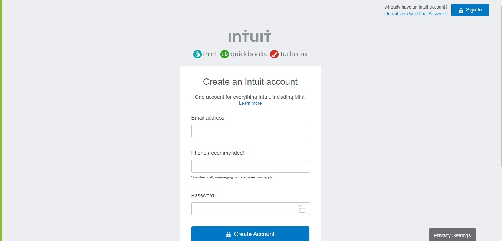

# HTML-Forms

> Mint sign up clone.

This project consists of building an HTML document that matches the appearance of mint.com’s signup page

## Built With

- Html,
- CSS

## Live Demo

[Live Demo Link](https://rawcdn.githack.com/Mupa1/HTML-Forms/281a64239aa8772124e73c9a0002709944f61505/index.html)

## Authors

👤 **Author1**

- Github: [@adamclasic](https://github.com/adamclasic)

👤 **Author2**

- Github: [@Mupa1](https://github.com/Mupa1)
- Twitter: [@mupa_mmbetsa](https://twitter.com/mupa_mmbetsa)
- Linkedin: [mupa-nzaphila-644788103)](https://www.linkedin.com/in/mupa-nzaphila-644788103/)

## 🤝 Contributing

Contributions, issues and feature requests are welcome! Start by:
* Forking the project
* Cloning the project to your local machine
* `cd` into the project directory
* Run `git checkout -b your-branch-name`
* Make your contributions
* Push your branch up to your forked repository
* Open a Pull Request with a detailed description to the development branch of the original project for a review

## 🤝 Contributing

Contributions, issues and feature requests are welcome!

Feel free to check the [issues page](https://github.com/Mupa1/HTML-Forms/issues)

## Show your support

Give a ⭐️ if you like this project!

## 📝 License

This project is [MIT](https://opensource.org/licenses/MIT) licensed.
